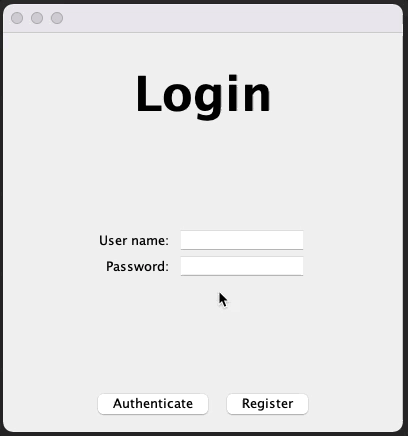

# Simple Swing Navigation Controller

This is a conceptual experiment into trying to devise page navigation controller for Swing.  Its intentions are to provide a model driven, modular framework which decouples the navigation workflows from the individual views.

It also attempts to alleviate the need for any view to adopt any kind conformity (ie `interface`), thus allowing just about any view to be used

# Requirements

 

# Why?

Navigating between views in Swing can be difficult.  Swing provides `CardLayout` for switching between existing views, but this (typically) requires the views to be instantiated up front, which makes concepts like dependency injection difficult and sharing of state becomes problematic.

Developing a navigation controller mechanism for `CardLayout` still takes a reasonable amount effort

Swing also provides `JTabbedPane`, which allows the user to choose which views they want to see.  This is not the same as guided navigation, where the next screen may change depending on what the user inputs on the current (or previous) views.

# High level design

MVC based, view stack, model backed controller.

The controller maintains a “stack” of views.  This provides a simple concept of “back”, where a view is simple “popped” off the stack to show the previous view.  A view can also be “replaced”, which will remove it from the stack, so the user can’t “back” onto it

Views can be presented in a non-linear fashion.  This allows implementations of the API to decide what they want to present and when. 

# Areas of improvement

As stated, this is an experimental work in progress.

The model isn’t really doing anything.  The controller already maintains a stack of its own, so the model really isn’t required to support this.  Preferably, the model should be managing some kind of “state” or “context” and the business logic which should determine which views should be presented when.
The “view factory”, while it decouples the creation of the views from the model and controller in a suitable way, adds a lot of additional overhead.

It would be nice to have the model perform this operation, but a model shouldn’t be generating view components, that’s not it’s responsibility.  Equally, I was trying to avoid requiring the developer to extend from the controller itself to implement this functionality.

The “view factory” is a standalone entity, it has no direct connection to either the controller or the model, as a factory should.  But, to make the model more useful, the factory should need to communicate with model, applying new state as it becomes available and requesting what should be done when the user wishes to move in a positive direction (ie, what comes next), `model.pushNextViewAfter(view, viewContext)`.

This would place responsibility onto the model to maintain a stack (so it knew what to present when a view was “popped”) and generate appropriate events to tell the controller when the state has changed.  The controller would still need some kind mapping between the “view” and the “component” for its own sake and this may need to be kept in an appropriate stack, allowing a “view” to be represented multiple times in the view
